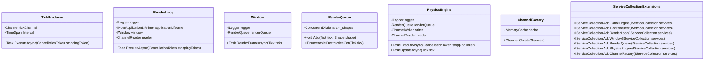

```mermaid
classDiagram
    class TickProducer {
        -Channel<Tick> tickChannel
        +TimeSpan Interval
        +Task ExecuteAsync(CancellationToken stoppingToken)
    }
    class RenderLoop {
        -ILogger<RenderLoop> logger
        -IHostApplicationLifetime applicationLifetime
        -IWindow window
        -ChannelReader<PhysicsEngineSignoff> reader
        +Task ExecuteAsync(CancellationToken stoppingToken)
    }
    class Window {
        -ILogger<Window> logger
        -RenderQueue renderQueue
        +Task RenderFrameAsync(Tick tick)
    }
    class RenderQueue {
        -ConcurrentDictionary<ulong, List<Shape>> _shapes
        +void Add(Tick tick, Shape shape)
        +IEnumerable<Shape> DestructiveGet(Tick tick)
    }
    class PhysicsEngine {
        -ILogger<PhysicsEngine> logger
        -RenderQueue renderQueue
        -ChannelWriter<PhysicsEngineSignoff> writer
        -ChannelReader<Tick> reader
        +Task ExecuteAsync(CancellationToken stoppingToken)
        +Task UpdateAsync(Tick tick)
    }
    class ChannelFactory {
        -IMemoryCache cache
        +Channel<T> CreateChannel<T>()
    }
    class ServiceCollectionExtensions {
        +IServiceCollection AddGameEngine(IServiceCollection services)
        +IServiceCollection AddTickProducer(IServiceCollection services)
        +IServiceCollection AddRenderLoop(IServiceCollection services)
        +IServiceCollection AddWindow(IServiceCollection services)
        +IServiceCollection AddRenderQueue(IServiceCollection services)
        +IServiceCollection AddPhysicsEngine(IServiceCollection services)
        +IServiceCollection AddChannelFactory(IServiceCollection services)
    }
```